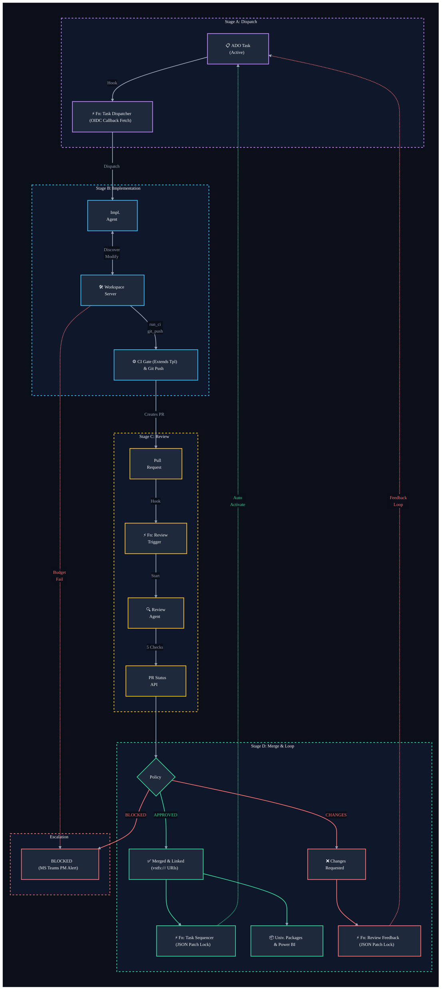

```mermaid
%%{init: {
  "theme": "dark",
  "themeVariables": {
    "primaryColor": "#1e293b",
    "primaryTextColor": "#f8fafc",
    "primaryBorderColor": "#334155",
    "lineColor": "#94a3b8",
    "secondaryColor": "#0f172a",
    "tertiaryColor": "#0b0f19",
    "fontFamily": "\"Inter\", -apple-system, sans-serif",
    "fontSize": "13px",
    "edgeLabelBackground": "#0b0f19" 
  },
  "flowchart": {
    "htmlLabels": true,
    "curve": "basis",
    "nodeSpacing": 45,
    "rankSpacing": 65,
    "padding": 25
  }
}}%%

flowchart LR
    %% ==========================================
    %% Master Background Wrapper (Fixes White PNG)
    %% ==========================================
    subgraph Canvas[" "]
        
        subgraph Stage_A [" Stage A: Dispatch "]
            A1["&nbsp;📋 ADO Task<br/>(Active)&nbsp;"]
            A2["&nbsp;⚡ Fn: Task Dispatcher<br/>(OIDC Callback Fetch)&nbsp;"]
            
            A1 -- "Hook" --> A2
        end

        subgraph Stage_B [" Stage B: Implementation "]
            B1["&nbsp;🤖 Impl.<br/>Agent&nbsp;"]
            B2["&nbsp;🛠️ Workspace<br/>Server&nbsp;"]
            B3["&nbsp;⚙️ CI Gate (Extends Tpl)<br/>& Git Push&nbsp;"]

            B1 <--"Discover<br/>Modify"--> B2
            B2 -- "run_ci<br/>git_push" --> B3
        end

        subgraph Stage_C [" Stage C: Review "]
            C1["&nbsp;🔀 Pull<br/>Request&nbsp;"]
            C2["&nbsp;⚡ Fn: Review<br/>Trigger&nbsp;"]
            C3["&nbsp;🔍 Review<br/>Agent&nbsp;"]
            C4["&nbsp;📝 PR Status<br/>API&nbsp;"]

            C1 -- "Hook" --> C2
            C2 -- "Start" --> C3
            C3 -- "5 Checks" --> C4
        end

        subgraph Stage_D [" Stage D: Merge & Loop "]
            D1{"&nbsp;Policy&nbsp;"}
            D2["&nbsp;✅ Merged & Linked<br/>(vstfs:/// URIs)&nbsp;"]
            D3["&nbsp;⚡ Fn: Task Sequencer<br/>(JSON Patch Lock)&nbsp;"]
            D4["&nbsp;❌ Changes<br/>Requested&nbsp;"]
            D5["&nbsp;⚡ Fn: Review Feedback<br/>(JSON Patch Lock)&nbsp;"]
            D6["&nbsp;📦 Univ. Packages<br/>& Power BI&nbsp;"]

            D1 -- "APPROVED" --> D2
            D2 --> D3
            D2 --> D6
            D1 -- "CHANGES" --> D4
            D4 --> D5
        end

        subgraph Stage_E [" Escalation "]
            E1["&nbsp;🛑 BLOCKED<br/>(MS Teams PM Alert)&nbsp;"]
        end

        %% Cross-Stage Routing
        A2 -- "Dispatch" --> B1
        B3 -- "Creates PR" --> C1
        C4 --> D1
        
        %% Automated Loops
        D5 -. "Feedback<br/>Loop" .-> A1
        D3 -. "Auto<br/>Activate" .-> A1

        %% Escalation Paths
        B2 -. "Budget<br/>Fail" .-> E1
        D1 -- "BLOCKED" --> E1

    end

    %% ==========================================
    %% 🎨 HARMONIZED STYLING
    %% ==========================================

    style Canvas fill:#0b0f19,stroke:none,color:transparent

    %% Subgraphs
    style Stage_A fill:#0f172a,stroke:#c084fc,stroke-width:2px,color:#f8fafc,stroke-dasharray: 5 5
    style Stage_B fill:#0f172a,stroke:#38bdf8,stroke-width:2px,color:#f8fafc,stroke-dasharray: 5 5
    style Stage_C fill:#0f172a,stroke:#fbbf24,stroke-width:2px,color:#f8fafc,stroke-dasharray: 5 5
    style Stage_D fill:#0f172a,stroke:#34d399,stroke-width:2px,color:#f8fafc,stroke-dasharray: 5 5
    style Stage_E fill:#0f172a,stroke:#f87171,stroke-width:2px,color:#f8fafc,stroke-dasharray: 5 5

    %% Nodes
    style A1 fill:#1e293b,stroke:#c084fc,stroke-width:2px,color:#f8fafc
    style A2 fill:#1e293b,stroke:#c084fc,stroke-width:2px,color:#f8fafc
    
    style B1 fill:#1e293b,stroke:#38bdf8,stroke-width:2px,color:#f8fafc
    style B2 fill:#1e293b,stroke:#38bdf8,stroke-width:2px,color:#f8fafc
    style B3 fill:#1e293b,stroke:#38bdf8,stroke-width:2px,color:#f8fafc
    
    style C1 fill:#1e293b,stroke:#fbbf24,stroke-width:2px,color:#f8fafc
    style C2 fill:#1e293b,stroke:#fbbf24,stroke-width:2px,color:#f8fafc
    style C3 fill:#1e293b,stroke:#fbbf24,stroke-width:2px,color:#f8fafc
    style C4 fill:#1e293b,stroke:#fbbf24,stroke-width:2px,color:#f8fafc
    
    style D1 fill:#1e293b,stroke:#34d399,stroke-width:2px,color:#f8fafc
    style D2 fill:#1e293b,stroke:#34d399,stroke-width:2px,color:#f8fafc
    style D3 fill:#1e293b,stroke:#34d399,stroke-width:2px,color:#f8fafc
    style D4 fill:#1e293b,stroke:#f87171,stroke-width:2px,color:#f8fafc
    style D5 fill:#1e293b,stroke:#f87171,stroke-width:2px,color:#f8fafc
    style D6 fill:#1e293b,stroke:#34d399,stroke-width:2px,color:#f8fafc

    style E1 fill:#1e293b,stroke:#f87171,stroke-width:2px,color:#f8fafc

    %% Edges (0-indexed exactly mapped to layout above)
    linkStyle default stroke:#94a3b8,stroke-width:2px,color:#94a3b8
    
    %% Success Paths (Mint #34d399)
    %% Indices: 6 (APPROVED), 7 (To Sequencer), 8 (To Packages), 15 (Activate Next)
    linkStyle 6,7,8,15 stroke:#34d399,stroke-width:2px,color:#34d399
    
    %% Unhappy/Escalation Paths (Red #f87171)
    %% Indices: 9 (CHANGES), 10 (To Feedback Fn), 14 (Feedback Loop), 16 (Budget Fail), 17 (BLOCKED)
    linkStyle 9,10,14,16,17 stroke:#f87171,stroke-width:2px,color:#f87171
```
